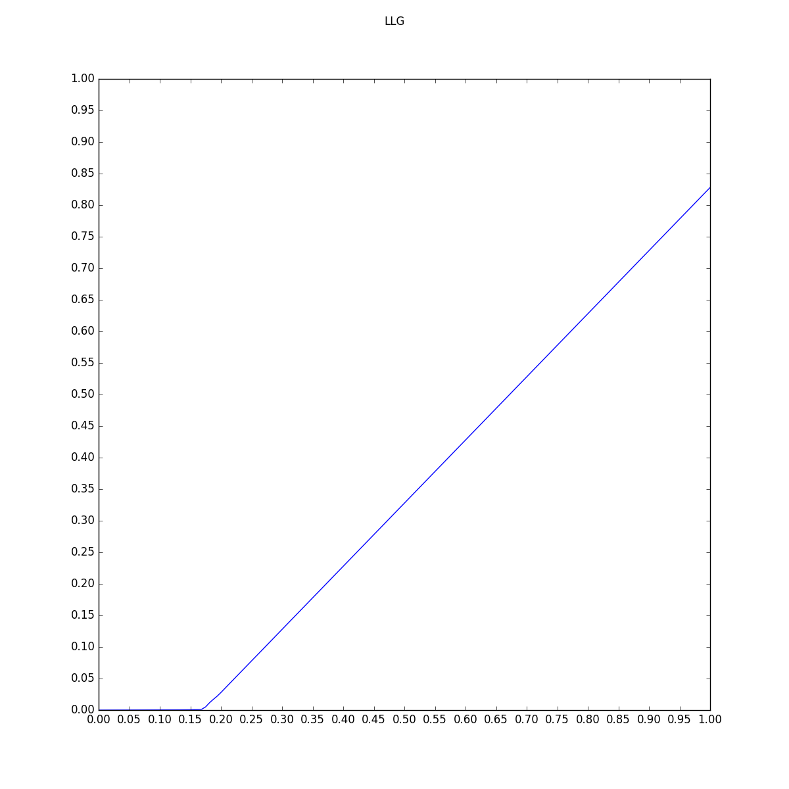
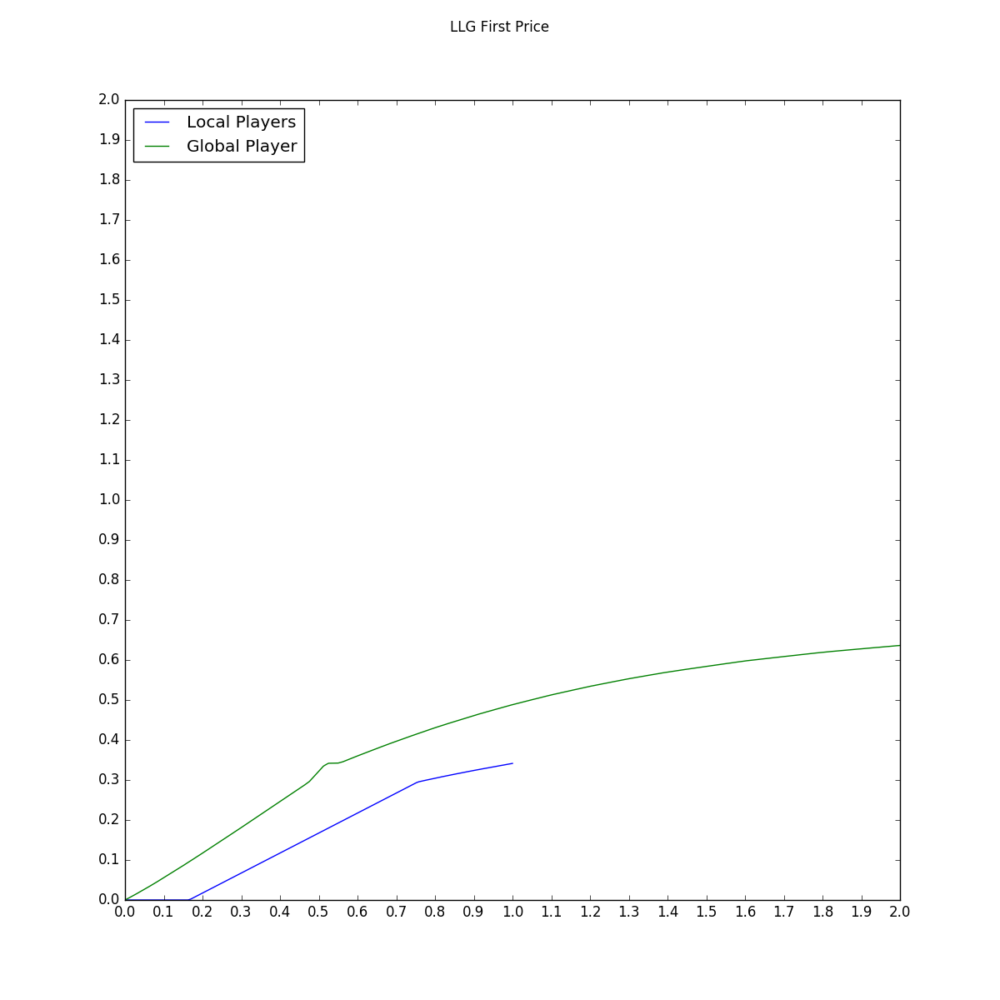

# CA-BNE

This is a piece of software used for numerically computing approximate Bayes-Nash equilibria (ε-BNEs) of combinatorial auctions. Our algorithm is described in detail in the following paper:

**Computing Bayes-Nash Equilibria in Combinatorial Auctions with Continuous Value and Action Spaces**  
Vitor Bosshard, Benedikt Bünz, Benjamin Lubin, and Sven Seuken. In Proceedings of the 26th International Joint Conference on Artificial Intelligence (IJCAI), Melbourne, Australia, August 2017. [[pdf](http://www.ifi.uzh.ch/ce/publications/BNE_Bosshard_et_al_IJCAI_2017-long.pdf)]

If you use this software for academic purposes, please cite the above in your work.

Note: this is a private beta release! If you have been given access to this repository, please do not share it further for the moment. The code will be made available publicly together with the definitive version of our paper, sometime in the first half of 2018.

## Installation

Requires Java 8 (or later). In eclipse, just create a new java project pointing towards the root folder of this repository and everything should compile correctly.
CPLEX is an optional dependency. The file cplex.jar needs to be added under Project --> Properties --> Java build path, and the location of the CPLEX native extensions needs to be provided to java at runtime (e.g. "java -Djava.library.path=cplex/bin/x86-64_linux ...")

## Example 1: LLG Quadratic

To demonstrate how to configure our algorithm, we include an example of the LLG domain, where there are two local bidders, each of which has a valuations drawn u.a.r. from [0,1] for one of two distinct items, and a global bidder, with a value drawn u.a.r. from [0,2] for the bundle of both items. The payment rule is quadratic, a.k.a. VCG-nearest.

First, we create a "BNESolverContext" object, which will contain all the objects making up our algorithm, and read in a configuration file. This class, as well as almost all other classes, is instanciated with two generic parameters, corresponding to the representation of values and bids.

	  BNESolverContext<Double, Double> context = new BNESolverContext<>();
	  String configfile = args[0];
	  context.parseConfig(configfile);

Then, we add all the pieces needed to specify the algorithm, from the way best responses are computed to how the strategies are updated.

	  context.setOptimizer(new PatternSearch<Double, Double>(context, new UnivariatePattern()));
	  context.setIntegrator(new MCIntegrator<Double, Double>(context));
	  context.setRng(2, new CommonRandomGenerator(2));
	  context.setUpdateRule(new UnivariateDampenedUpdateRule(0.2, 0.7, 0.5 / context.getDoubleParameter("epsilon"), true));
	  context.setBRC(new AdaptivePWLBRCalculator(context));
	  context.setOuterBRC(new PWLBRCalculator(context));
	  context.setVerifier(new ExactUnivariateVerifier(context));

Then, we add the objects representing the auction setting

	  context.setMechanism(new Quadratic());
	  context.setSampler(new UniformLLGSampler(context));

We instantiate the BNE algorithm for an auction with 3 players and the given context.

	  BNEAlgorithm<Double, Double> bneAlgo = new BNEAlgorithm<>(3, context);

We set the initial strategies for the bidders to be truthful. Bidder 1 (the second local bidder) is in a position symmetric to bidder 0 (the first local bidder), so we make him play bidder 0's strategy. The global bidder is known to bid truthful [Beck and Ott, 2013], so we don't update his strategy. This results in the algorithm only updating bidder 0's strategy each round.

	 bneAlgo.setInitialStrategy(0, UnivariatePWLStrategy.makeTruthful(0.0, 1.0));
	 bneAlgo.setInitialStrategy(2, UnivariatePWLStrategy.makeTruthful(0.0, 2.0));
	 bneAlgo.makeBidderSymmetric(1, 0);
	 bneAlgo.makeBidderNonUpdating(2);

To actually see what's going on during the algorithm's execution, we implement a special callback interface that gets invoked after each iteration. In this example, we will just output the intermediate strategies computed for bidder 0, along with the estimated epsilon.

	 BNEAlgorithmCallback<Double, Double> callback = new BNEAlgorithmCallback<Double, Double>() {
		@Override
		public void afterIteration(int iteration, BNEAlgorithm.IterationType type, List<Strategy<Double, Double>> strategies, double epsilon) {
			StringBuilder builder = new StringBuilder();
			builder.append(String.format("%2d", iteration));
			builder.append(String.format(" %7.6f  ", epsilon));
	
			UnivariatePWLStrategy sPWL = (UnivariatePWLStrategy) strategies.get(0);
			for (Map.Entry<Double, Double> e : sPWL.getData().entrySet()) {
				builder.append(String.format("%7.6f",e.getKey()));
				builder.append(" ");
				builder.append(String.format("%7.6f",e.getValue()));
				builder.append("  ");
			}
			System.out.println(builder.toString());
	 	}
	 };
	 bneAlgo.setCallback(callback);

Finally, we run the algorithm

	 bneAlgo.run();

The full example can be found [here](src/ch/uzh/ifi/ce/cabne/examples/LLGQuadratic.java). It takes as input a path pointing to a configuration file, e.g. [LLG.config](config/LLG.config).
The output can be visualized using the following [Python script](scripts/llg_anim_BNE.py). The computed BNE should look something like this:

## Implementing your own Auctions

In order to compute an equilibrium for your own domain and payment rule, there are two interfaces you need to implement: a BidSampler and a Mechanism.

The BidSampler interface provides an iterator that yields samples of bid profiles drawn according to the value distributions and strategies of all bidders. A bid profile is represented as an array of the generic 'Bid' type. Within this class, one can add integration tricks such as importance sampling as well.

The Mechanism interface implements the mapping from a valuation v_i and a bid profile b all the way to a bidder's utility u_i.
This is slightly unintuitive, since one would expect an auction mechanism to consist of an allocation and a payment rule, with the output of these rules being fed into some explicit utility function. However, the way it is implemented makes sense from a computational perspective. We are avoiding the creation of an expensive object representing the allocation, which in most cases would just be passed to the utility function where it is read once, then destroyed. This way, the class implementing the Mechanism interface is free to internally represent the auction outcome however it sees fit.

Note that the BidSampler will want to make use of a random number generator, so you need to make sure that one with the correct dimensionality is added to the context. The dimension will typically be the total number of bundles all bidders except i are interested in.

## Example 2: LLG First Price

As a second example, we want to find a BNE for the first price rule in LLG. This is harder than the quadratic rule from example 1 because the change in payment rule implies that the global player is not truthful anymore.

In order to assist fast convergence, we would like to implement importance sampling in the [bid sampler](src/ch/uzh/ifi/ce/cabne/domains/FirstPriceLLG/FirstPriceLLGSampler.java) for this domain.
However, to do this we need to be able to invert the strategies, which requires them to be monotone.
To make sure this is the case, we modify the strategies in between iterations. This is implemented by adding a couple lines of code to the callback function:

	for (int i=0; i<3; i+=2) {
		UnivariatePWLStrategy s = (UnivariatePWLStrategy) strategies.get(i);
		SortedMap<Double, Double> data = s.getData();
		SortedMap<Double, Double> newdata = new TreeMap<>();
		
		double previousBid = 0.0;
		for (Map.Entry<Double, Double> e : data.entrySet()) {
			double v = e.getKey();
			double bid = Math.max(previousBid + 1e-6, e.getValue());
			newdata.put(v, bid);
			previousBid = bid;
		}
		strategies.set(i, new UnivariatePWLStrategy(newdata));
	}
	strategies.set(1, strategies.get(0));

The code can be found [here](src/ch/uzh/ifi/ce/cabne/examples/LLGFirstPrice.java) and the script to visualize results is [here](scripts/llg_fp_anim_BNE.py). The resulting BNE should look something like this:

## Example 3: LLLLGG

Finally, we consider a much larger example where we find a BNE for the first price rule in the LLLLGG domain. This is a much larger auction than LLG, with 6 bidders and 8 items, but the code is very similar to example 1. The main difference is that Values and Bids are multidimensional, implemented as Double[]. The BidSampler and Mechanism implementations are responsible themselves to interpret these arrays of raw data in a consistent way. This domain could also be implemented by writing Java classes representing Values and Bids, but this would make the code slower. All algorithm pieces are provided in a variant supporting multiple dimensions.

In addition to the first price rule, our code also provides an implementation of quadratic and other core-selecting payment rules in LLLLGG, but it should be noted that quadratic requires a quadratic program (QP) solver such as CPLEX to be installed.

The code for this example can be found  [here](src/ch/uzh/ifi/ce/cabne/examples/LLLLGGFirstPrice.java).
It takes two arguments, a configuration file and an output folder, where the callback function writes out one file per iteration. 
The progress of the algorithm can be visualized with the help of another [Python script](scripts/llllgg_anim_BNE.py). The approximate equilibrium should look something like this:

## Beta Notes

There are a few thing missing from this beta release that will be added in the public release
* A generic auction builder, where you only specify the auction topology in an abstract way, and an implementation of the required interfaces is automatically generated.
* The full code used to run the experiments in our paper.
* The scripts we used to distribute the running of the algorithm over our compute cluster. While this only runs on our hardware, it demonstrates how to implement a parallel version of the BNEAlgorithm class.

 

